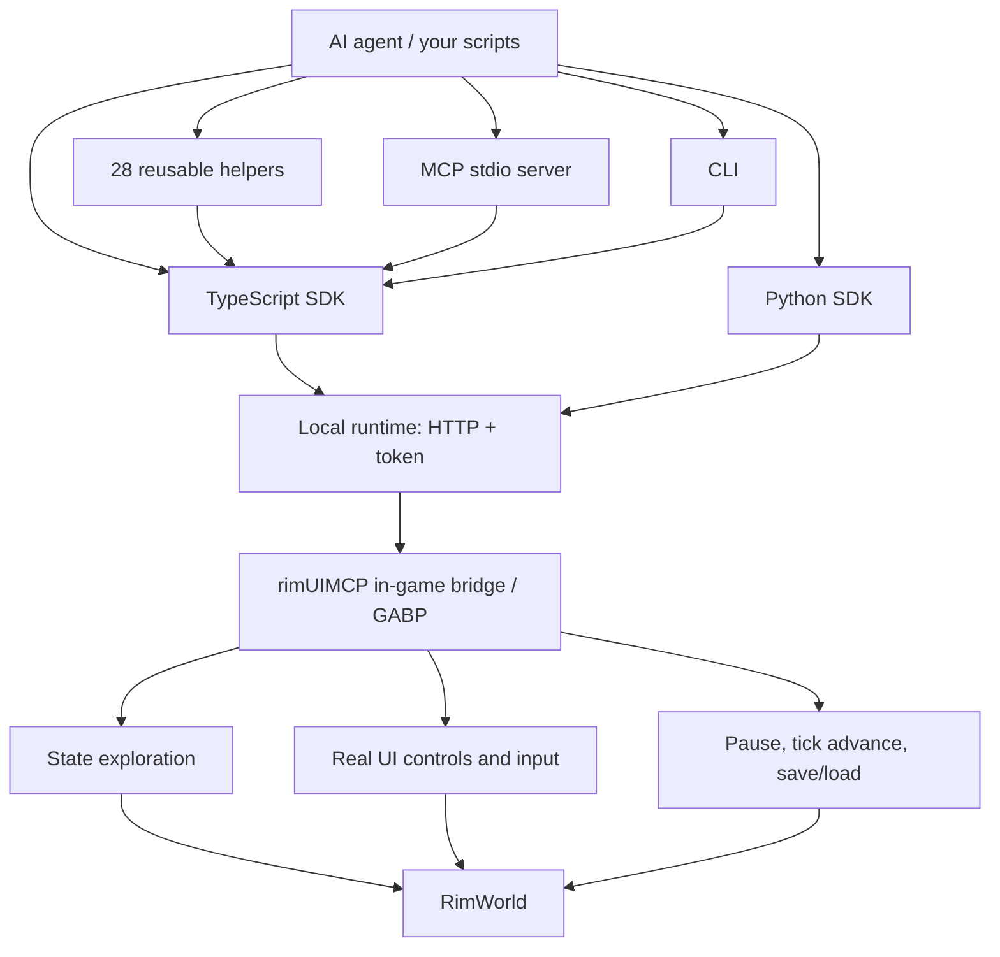

# rimUIMCP

English · [简体中文](README.md)

**Enable AI to understand RimWorld and manage your colony directly through the game's native user interface.**

rimUIMCP provides an in-game mod, a unified runtime, TypeScript and Python SDKs, a CLI, and an MCP (Model Context Protocol) entry point. AI agents can read pawns, items, map states, and research progress, and then issue commands by interacting with actual buttons, menus, design tools, and the map. General helpers combine common operations, making it easy to write your own management and combat strategies.

The current source code targets Windows and RimWorld 1.6; pre-built installation packages are not yet available. This repository contains the low-level bridge and 28 general helpers. Specific colony saves, tactical scripts, recordings, and local configurations are excluded.

## Getting Started

### 1. Prerequisites

- A licensed copy of RimWorld 1.6 with the Harmony Mod installed.
- Node.js 24, pnpm, and the .NET 10 SDK. PowerShell 7 is highly recommended.
- Python 3.10 or higher (only required if using the Python client or scripts).

Currently verified primarily on Windows. The build process downloads dependencies and game reference assemblies from NuGet; there is no need to manually copy game DLLs into the repository.

### 2. Clone and Build

```powershell
git clone https://github.com/Hcrab/rimUIMCP.git
cd rimUIMCP
pnpm install --frozen-lockfile
./scripts/build.ps1
```

The build script prioritizes the executable specified by `DOTNET_EXE`, falls back to `dotnet` in your PATH, and is also compatible with a local installation at `work/dotnet/dotnet.exe`. Building does not automatically deploy to a running game.

### 3. Start the Game and Connect

Close any running RimWorld processes, then specify your game installation directory:

```powershell
$env:RIMWORLD_ROOT = 'C:\Program Files (x86)\Steam\steamapps\common\RimWorld'
./scripts/launch.ps1 start -Visible
node apps/cli/src/main.ts session.status
```

The startup script copies the mod to the game's `Mods/rimUIMCP` directory, uses an isolated profile at `work/game-profile` to store configurations and saves, and launches the local runtime. Once the game starts, create or load a colony to begin reading map states and issuing commands.

Connection details are automatically written to `work/runtime.json`, which contains a local access token. Do not commit or share this file. The launcher creates an isolated game profile; if your existing saves rely on other mods, you must enable those same dependencies within this profile.

### 4. Use TypeScript or Python

Save the following TypeScript code as `work/inspect.ts` inside the repository, and run it with `node work/inspect.ts`:

```ts
import { connect } from '../packages/sdk/src/index.ts';

const game = await connect();
console.log((await game.status()).data);
console.log((await game.state.pawns({ budgetMs: 200 })).data);

// Open the actual work panel, then inspect its visible controls.
await game.ui.panel('work').open();
console.log((await game.ui.snapshot()).data);
```

The Python client shares the same method signatures and return semantics:

```powershell
python -m pip install -e ./packages/python
```

```python
import asyncio
from rimuimcp import connect

async def main():
    game = await connect()
    print(await game.call("state.pawns", budgetMs=200))

asyncio.run(main())
```

Clients read `work/runtime.json` by default. You can also point to an alternative connection configuration using the `RIMUIMCP_CONFIG` environment variable. Reading collections may be paginated; when you need all pawns or items, use helpers like `readAllPawns` or `queryAll` instead of assuming a single-page result represents the entire map.

### 5. Integrate with MCP-Enabled AI Clients

Add the following service to your client's MCP configuration, replacing the path with your local clone directory:

```json
{
  "mcpServers": {
    "rimuimcp": {
      "command": "node",
      "args": ["C:/projects/rimUIMCP/apps/mcp/src/main.ts"],
      "env": {
        "RIMUIMCP_CONFIG": "C:/projects/rimUIMCP/work/runtime.json"
      }
    }
  }
}
```

The game and the local runtime must be running beforehand. The MCP server exposes a unified tool named `rimuimcp_call`, which accepts `method`, `args`, and an optional timeout. For example:

```json
{"method":"session.status","args":{}}
```

You can then read `state.roots`, `state.pawns`, or `ui.snapshot`. The exact location of the configuration file depends on the AI client you use.

## Architecture



- **In-game Bridge**: Runs on the game thread to read state, locate UI controls, execute inputs, and return execution paths along with evidence of results.
- **Local Runtime**: Unifies client calls, script execution, events, and AI requests. TypeScript, Python, CLI, and MCP clients all share these semantics.
- **General Helpers**: Combine low-level capabilities to handle common tasks like positioning, interaction, and state verification. High-level goals and tactical decisions are left to the caller.

State reading and action execution are separated: you can inspect a comprehensive internal state, but standard gameplay actions are still routed through the game's existing UI. Fixture capabilities used for testing must be explicitly enabled; normal usage does not require the `-Fixture` flag.

## General Helpers

All modules are located in [`agent/helpers`](agent/helpers). Choose and use them based on your tasks; there is no need to load a rigid, pre-defined strategy.

| Task | Modules |
|---|---|
| Observation, map inspection, and summary | `observe`、`pawns`、`colony-inspection`、`inspection-summary` |
| Pawns, work, schedules, equipment, health, beds, and custody | `pawn`、`work`、`schedule`、`equipment`、`health`、`bed`、`custody` |
| Construction, zones, growing, layout, and navigation | `architect`、`areas`、`growing`、`layout`、`navigation` |
| Production, food, storage, resources, research, and science | `production`、`food`、`storage`、`resources`、`research`、`science` |
| Tactics, letters, flow, and supervision | `tactical`、`letters`、`flow`、`supervision` |
| Control positioning and language adaptation | `selection`、`ui-text` |

The UI text helper covers common English and Simplified Chinese labels, but this does not guarantee support for all languages or modded interfaces. Object references are bound to specific sessions and world versions; you should re-query them after loading a save. For details, see [Reference Lifecycle](docs/reference-lifecycle.md).

Multiple scripts can share the load of observation and computation. Organize operations targeting the same interface into short batches using `game.sequence(...)`, and coordinate time progression through a single executor to prevent control conflicts.

## Development and Verification

```powershell
pnpm build
pnpm test
./scripts/build.ps1
./scripts/verify.ps1 -Suite unit
```

Unit tests can run offline. Live checks like `tests/live-*.ts` require a running game, and some depend on dedicated fixture saves. These saves are not distributed with the repository; do not run the full suite of live tests directly on your active play colonies.

Directory Responsibilities: `bridge/rimUIMCP` contains the C# Mod, `packages/runtime` is the local service, `packages/sdk` and `packages/python` are the clients, `apps` hosts the CLI/MCP, and `agent/helpers` contains reusable operations. The `work/` and `runs/` directories, recordings, credentials, saves, and game assemblies are all excluded from version control.

The local runtime can execute local scripts and control both the game and save files. Only connect agents you trust, keep bindings restricted to localhost with token authentication, and do not expose the service directly to the public internet.

## License and Acknowledgments

The project's original source code is licensed under the [MIT License](LICENSE). The in-game bridge is derived from Andreas Pardeike's [RimBridgeServer](https://github.com/pardeike/RimBridgeServer) and retains its MIT license and attribution. For dependency and derivation boundaries, see [Third-Party Notices](THIRD_PARTY_NOTICES.md) and [Upstream Records](bridge/rimUIMCP/UPSTREAM.md).

RimWorld and its related assets are the property of Ludeon Studios. This project does not include the game, DLCs, game assemblies, or decompiled source code, and is not affiliated with Ludeon Studios.

> Portions of the materials used to create this content/mod are trademarks and/or copyrighted works of Ludeon Studios Inc. All rights reserved by Ludeon. This content/mod is not official and is not endorsed by Ludeon.
