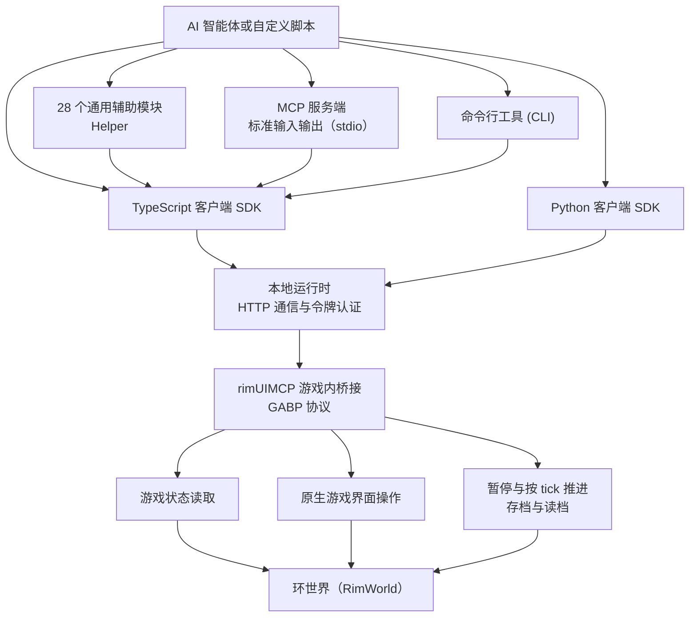

# rimUIMCP

[English](README.en.md) · 简体中文

**让 AI 读懂《环世界》（RimWorld），并通过游戏原生界面操控殖民地。**

rimUIMCP 提供了游戏内 Mod、统一运行时、TypeScript / Python SDK、CLI 以及 MCP 接口。AI 能够读取角色（Pawn）、物品、地图及研究状态，并通过模拟真实的按钮点击、菜单选择、规划工具和地图交互来下达指令。内置的通用 Helper 将常用操作进行封装，便于你快速构建自定义的经营与战斗策略。

当前源码适用于 Windows 平台与 RimWorld 1.6，暂未发布预编译安装包。本仓库包含底层桥接代码与 28 个通用 Helper；具体的殖民地存档、战术脚本、运行录像及本地配置文件均不包含在内。

## 开始使用

### 1. 准备环境

- 正版 RimWorld 1.6，并安装 Harmony Mod。
- Node.js 24、pnpm、.NET 10 SDK；推荐使用 PowerShell 7。
- Python 3.10 或更高版本（仅在使用 Python 客户端或脚本时需要）。

目前主要在 Windows 环境下进行验证。构建过程会直接从 NuGet 下载依赖与游戏引用程序集，无需手动将游戏 DLL 放入仓库。

### 2. 获取源码并构建

```powershell
git clone https://github.com/Hcrab/rimUIMCP.git
cd rimUIMCP
pnpm install --frozen-lockfile
./scripts/build.ps1
```

构建脚本会优先使用 `DOTNET_EXE` 环境变量指定的程序，其次查找 PATH 中的 `dotnet`，同时也兼容本地 `work/dotnet/dotnet.exe`。构建完成后不会自动部署到正在运行的游戏中。

### 3. 启动游戏并连接

请先关闭已有的 RimWorld 进程，然后指定游戏的实际安装目录：

```powershell
$env:RIMWORLD_ROOT = 'C:\Program Files (x86)\Steam\steamapps\common\RimWorld'
./scripts/launch.ps1 start -Visible
node apps/cli/src/main.ts session.status
```

启动脚本会将 Mod 复制到游戏的 `Mods/rimUIMCP` 目录下，使用独立的 `work/game-profile` 路径来保存配置与存档，并启动本地运行时。随后在游戏界面中创建或加载一个存档，即可开始读取地图并下达操作。

连接信息会自动写入 `work/runtime.json`，其中包含本地访问令牌，请勿提交或分享该文件。启动器创建的是独立的游戏配置；若你已有的殖民地依赖其他 Mod，需要在此配置中启用相同的依赖。

### 4. 使用 TypeScript 或 Python 调用

将下面的 TypeScript 代码保存为仓库内的 `work/inspect.ts`，并使用 `node work/inspect.ts` 运行：

```ts
import { connect } from '../packages/sdk/src/index.ts';

const game = await connect();
console.log((await game.status()).data);
console.log((await game.state.pawns({ budgetMs: 200 })).data);

// 打开真实工作面板，再读取当前可见控件。
await game.ui.panel('work').open();
console.log((await game.ui.snapshot()).data);
```

Python 客户端使用完全相同的方法与返回语义：

```powershell
python -m pip install -e ./packages/python
```

```python
import asyncio
from rimuimcp import connect

async def main():
    game = await connect()
    print(await game.call("state.pawns", budgetMs=200))

asyncio.run(main())
```

客户端默认读取仓库内的 `work/runtime.json`。你也可以通过设置 `RIMUIMCP_CONFIG` 环境变量指向另一份连接配置。集合读取可能会进行分页；当需要获取全图的人物或物品时，请使用 `readAllPawns`、`queryAll` 等 Helper，避免将单页结果误认为全图数据。

### 5. 接入支持 MCP 的 AI 客户端

在客户端的 MCP 配置中添加以下服务，并将路径替换为你本地的克隆目录：

```json
{
  "mcpServers": {
    "rimuimcp": {
      "command": "node",
      "args": ["C:/projects/rimUIMCP/apps/mcp/src/main.ts"],
      "env": {
        "RIMUIMCP_CONFIG": "C:/projects/rimUIMCP/work/runtime.json"
      }
    }
  }
}
```

请确保游戏与本地运行时已提前启动。MCP 服务暴露了统一的工具 `rimuimcp_call`，其参数包括 `method`、`args` 以及可选的超时时间等。例如：

```json
{"method":"session.status","args":{}}
```

连接成功后，即可读取 `state.roots`、`state.pawns` 或 `ui.snapshot`。具体的配置文件存放位置取决于你所使用的 AI 客户端。

## 架构

想了解调用如何执行、各层怎样配合，以及在哪里扩展功能，可以继续阅读 [架构与扩展指南](architecture.md)。按任务查找用法请看 [Helper 使用指南](agent/helpers/README.md)。



- **游戏内桥接**：在游戏主线程中读取状态、定位 UI 控件、执行输入，并返回处理路径与结果凭据。
- **本地运行时**：统一客户端调用、脚本执行、事件监听与 AI 请求；TypeScript、Python、CLI 和 MCP 共享这些底层语义。
- **通用 Helper**：组合底层能力，负责常见任务的定位、操作与状态读回；高层目标与战术决策由调用方控制。

读取与动作执行相互分离：你可以探索较为完整的内部状态，但常规的玩法操作仍通过游戏已有的 UI 逻辑进行。用于测试的 Fixture 能力需要显式启用；普通使用无需添加 `-Fixture` 参数。

## 通用 Helper

所有模块均位于 [`agent/helpers`](agent/helpers) 目录下。你可以根据任务需要灵活选用，无需加载整套固定的策略。

| 任务 | 模块 |
|---|---|
| 观察、全图巡检与摘要 | `observe`、`pawns`、`colony-inspection`、`inspection-summary` |
| 人物、工作、装备和健康 | `pawn`、`work`、`schedule`、`equipment`、`health`、`bed`、`custody` |
| 建设与区域 | `architect`、`areas`、`growing`、`layout`、`navigation` |
| 生产、食物、仓储与科研 | `production`、`food`、`storage`、`resources`、`research`、`science` |
| 战术、通知与运行监督 | `tactical`、`letters`、`flow`、`supervision` |
| 控件定位与语言适配 | `selection`、`ui-text` |

UI 文本 Helper 已覆盖常用的英文和简体中文标签，但这并不代表已支持所有语言或所有 Mod 的界面。对象引用带有会话和世界版本属性；重新读档后应重新查询，详情请参阅 [引用生命周期](docs/reference-lifecycle.md)。

多个脚本可以分担观察与计算任务；针对同一界面的操作建议使用 `game.sequence(...)` 组织成短批次，并由单一执行者协调时间推进，以避免相互抢占控制权。

## 开发与验证

```powershell
pnpm build
pnpm test
./scripts/build.ps1
./scripts/verify.ps1 -Suite unit
```

单元测试支持离线运行。而 `tests/live-*.ts` 等实机检查则需要运行中的游戏支持，部分测试还依赖专用的 Fixture 存档；这些存档不随仓库分发，请勿直接对正在游玩的殖民地运行全套实机测试。

目录职责划分：`bridge/rimUIMCP` 为 C# Mod，`packages/runtime` 为本地服务，`packages/sdk` 与 `packages/python` 为客户端 SDK，`apps` 提供 CLI/MCP 入口，`agent/helpers` 存放可复用的操作。`work/`、`runs/` 目录、录像、凭据、存档以及游戏程序集均已排除在版本控制之外。

本地运行时具备执行本地脚本、操作游戏和修改存档的能力。请仅连接你信任的 Agent，保持本地绑定与令牌鉴权，切勿将服务直接暴露到公网上。

## 许可与致谢

项目自有源码采用 [MIT License](LICENSE)。游戏内桥接代码派生自 Andreas Pardeike 的 [RimBridgeServer](https://github.com/pardeike/RimBridgeServer)，并保留其 MIT 许可与署名。依赖和派生边界详见 [第三方说明](THIRD_PARTY_NOTICES.md) 与 [上游记录](bridge/rimUIMCP/UPSTREAM.md)。

RimWorld 及其相关内容归 Ludeon Studios 所有。本项目不包含游戏、DLC、游戏程序集或反编译源码，亦不代表 Ludeon 官方立场。

> Portions of the materials used to create this content/mod are trademarks and/or copyrighted works of Ludeon Studios Inc. All rights reserved by Ludeon. This content/mod is not official and is not endorsed by Ludeon.
