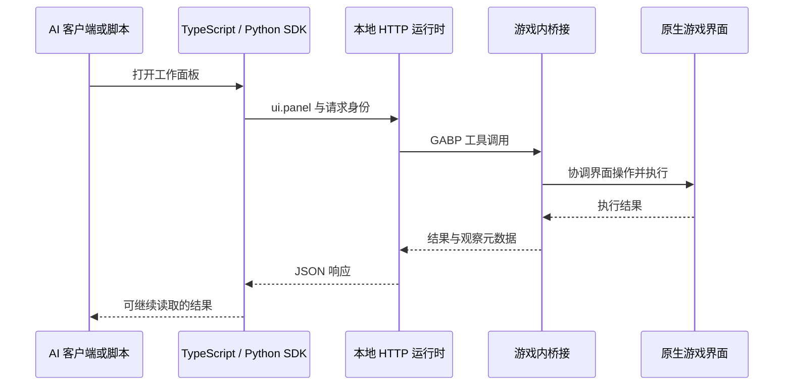

# rimUIMCP 架构与扩展指南

rimUIMCP 将游戏状态读取、原生界面操作与本地脚本执行连接起来，让 AI 可以观察殖民地、下达指令并核实结果。本文通过一次调用流程，介绍各层职责、执行方式和扩展位置。您可以参考 [README](README.md) 完成安装与启动，并根据具体任务在 [Helper 指南](agent/helpers/README.md) 中选择合适的辅助模块。

## 一次调用经过什么

以 `game.ui.panel('work').open()` 为例，TypeScript SDK 会将方法名 `ui.panel` 和参数 `{name:'work'}` 发送至本地 HTTP 运行时。运行时随后将其转交给游戏内的 `rimuimcp/call` 工具，由 C# 桥接协调并执行原版界面逻辑，最终将执行结果与观察元数据返回给客户端。CLI 和 MCP 同样通过该 TypeScript SDK 接入，而 Python 则通过独立实现相同的 HTTP 请求协议来完成交互。

| 层 | 入口与职责 |
| --- | --- |
| 客户端入口 | [CLI](apps/cli/src/main.ts)、[MCP](apps/mcp/src/main.ts)：解析调用参数，输出结构化结果。MCP 工具名是 `rimuimcp_call`。 |
| 客户端 SDK | [TypeScript](packages/sdk/src/index.ts)、[Locator](packages/sdk/src/locators.ts)、[Python](packages/python/rimuimcp/__init__.py)：配置、身份、超时、错误和序列令牌。 |
| 通用 Helper | [agent/helpers](agent/helpers/README.md)：组合读取与界面操作，处理定位、分页、读回；部分包含明确的运行策略。 |
| 本地运行时 | [host.ts](packages/runtime/src/host.ts)：HTTP 入口与路由；[actions.ts](packages/runtime/src/actions.ts)：规范化请求；[bridge.ts](packages/runtime/src/bridge.ts)：GABP 传输。 |
| 本地脚本与问答 | [scripts.ts](packages/runtime/src/scripts.ts) 管理子进程、预算和日志；[agent.ts](packages/runtime/src/agent.ts) 保存外部 AI 问答。 |
| 游戏内 API | [ToolSurface.cs](bridge/rimUIMCP/Source/RimUIMCP/ToolSurface.cs) 分发方法；[SessionRuntime.cs](bridge/rimUIMCP/Source/RimUIMCP/SessionRuntime.cs) 管理身份、事件、取消及 UI 序列。 |
| 游戏状态、UI 与时间 | [StateReader.cs](bridge/rimUIMCP/Source/RimUIMCP/StateReader.cs)、[UiSnapshot.cs](bridge/rimUIMCP/Source/RimUIMCP/UiSnapshot.cs)、[UiInput.cs](bridge/rimUIMCP/Source/RimUIMCP/UiInput.cs)、[RuntimeControl.cs](bridge/rimUIMCP/Source/RimUIMCP/RuntimeControl.cs)。具体界面适配位于 [Adapters](bridge/rimUIMCP/Source/RimUIMCP/Adapters)。 |

`bridge/rimUIMCP/Source` 保留了 RimBridgeServer 派生底座，提供主线程调度、输入、截图、能力模块以及 C# SDK。`Source/RimUIMCP` 负责实现本项目的统一 API，您可以通过 `session.status` 返回的能力列表来获取所有可用的对外方法。关于来源与许可的详细信息，请参阅 [UPSTREAM.md](bridge/rimUIMCP/UPSTREAM.md)。

## 启动与连接文件

1. `scripts/build.ps1` 构建 Mod 并完成客户端类型检查，生成供启动器部署的产物。
2. `scripts/launch.ps1 start -Visible` 复制 Mod、使用独立 `work/game-profile` 启动游戏，读取桥接日志中的端口与令牌，写入 `work/connection.json`。随后在本地运行时未运行时启动它。
3. `host.ts` 从 `connection.json` 读取游戏内桥接的连接信息，默认监听 `127.0.0.1:18741`，生成另一枚本地 HTTP 令牌并写入 `work/runtime.json`。
4. SDK 从 `runtime.json` 连接 HTTP 服务；`connect()` 会先调用 `session.status`。连接成功后，检查 `gameLoaded`、`mapLoaded` 即可确认殖民地与地图是否准备就绪。

系统通过两份配置文件管理不同的连接：`connection.json` 负责运行时到游戏的连接，`runtime.json` 负责客户端到运行时的连接。鉴于令牌与当前进程的生命周期相关联，当运行时重启后，客户端通过重新读取配置来恢复连接。

| 环境变量 | 用途 |
| --- | --- |
| `RIMWORLD_ROOT` | 游戏安装目录，供启动脚本使用。 |
| `DOTNET_EXE` | 指定构建用的 .NET 可执行文件。 |
| `RIMUIMCP_ROOT` | 本地运行时的项目根目录；启动器也把它传给游戏，用于桥接日志。 |
| `RIMUIMCP_PORT` | HTTP 端口，默认 18741。 |
| `RIMUIMCP_CONFIG` | 客户端使用的 `runtime.json` 路径。 |
| `RIMUIMCP_SCRIPT_ID` | 客户端所属脚本身份；脚本运行器自动注入。 |
| `RIMUIMCP_PYTHON` | 脚本运行器使用的 Python 可执行文件。 |
| `RIMUIMCP_FFMPEG` | 录像工具的 FFmpeg 路径，默认使用 PATH 中的 `ffmpeg`。 |

## 结果表示什么

游戏内 API 的成功响应包含 `success`、`requestId`、`meta` 和 `data`，并记录调用开始和结束时的观察元数据 `started` 与 `ended`。其中元数据（`meta`）提供了 `sessionId`、`worldEpoch`、`mapId`、`gameTick`、`uiFrame` 和 `snapshotId` 等信息。对于在本地处理的 `scripts.*` 与 `agent.*` 调用，系统返回 `meta: null`；当您需要获取游戏时刻信息时，可以通过读取 `session.status` 来获取。

动作执行结果包含 `path`、`inputProcessed`、`commandAccepted`、`completion` 和 `evidence` 等字段，由具体方法根据需要提供。当 `success: true` 时表示调用已成功返回，而人物的搬运、穿戴和建造等实际进度则通过动作证据与后续状态来呈现。例如，`prioritize` 用于核实工作是否已被接收，`wear` 则在推进受监控游戏时间的同时核实装备的实际归属。调用方可以通过分析具体动作的证据来准确判断任务的完成程度。

通过 `path` 字段，系统区分了 `ui-control`、`ui-input`、`runtime` 与 `fixture`。常规界面动作直接作用于实际游戏 UI，时间控制与存读档功能通过 runtime 路径实现，而测试 Fixture 则支持显式启用。在进行实机验证时，您可以通过 `path` 区分测试准备工作与实际的界面操作。

当遇到结构化失败时，SDK 会抛出 `RimError` 并完整保留 `code` 和原始 `result`。若发生传输断开或超时，您可以通过读取当前状态，或使用 `session.result` 查询已知 `requestId` 来确定后续步骤，并由调用方自主安排重试。请求结果保存在当前进程的有界缓存中，系统会根据容量需要淘汰已完成的记录，您也可以通过调用日志来实现长期保存。同一请求 ID 对应同一组方法、参数、脚本与序列身份。重复请求会复用缓存中的结果或任务；身份或参数不一致时返回 `REQUEST_ID_CONFLICT`。

## UI 序列、线程和时间

状态读取由游戏主线程统一调度。游戏内的普通 `state.*` 与 `session.status` 无需占用 UI 序列，而 UI 和 runtime 等动作则通过统一的串行入口执行。这种分工支持多个脚本并行进行观察和计算，同时由串行入口协调对共享界面的操作。

通过 `game.sequence(async game => {...})`，系统可以申请由 `scriptId` 和令牌标识的 UI 租约，利用异步上下文将令牌传递给该批次的所有调用，并在 `finally` 块中自动释放，嵌套序列则支持复用该令牌。Python 客户端可以使用 `async with game.sequence():` 实现相同功能。序列用租约协调一组界面操作，游戏时间由调用方控制。租约适合短批次；串行入口会检查有效期，并在持有者通过时续期。即使中途出现异常，已经完成的点击操作依然生效，便于后续流程根据当前状态继续执行。

序列非常适合用于“选中对象 → 打开菜单 → 激活选项 → 读回”这类短批次操作。当需要引入外部 AI 决策时，可以先结束当前序列并调用 `agent.request`，从而释放界面供其他执行者使用。系统会通过 `SEQUENCE_HELD` 提示当前仍持有序列的请求。执行方可以自主协调时间的推进：使用 `runtime.nextFrame` 等待下一帧，使用 `runtime.advance` 按 tick 推进，或者利用 `runAndWatch` 这一 Helper 实现持续运行、定期观察并在结束时自动尝试暂停，后者按轮询观察进度，实际推进量可能比 tick 预算多一个轮询间隔。

使用 `session.cancel` 可以取消脚本的桥接等待并释放其持有的租约，同时保留已执行输入在游戏中的效果。`scripts.cancel` 则会进一步结束本地子进程；即使桥接取消遇到异常，系统仍会尝试终止子进程，并通过 `cleanupErrors` 记录清理结果。

## 引用与观察一致性

`ObjectRef` 包含了会话、世界版本与句柄 ID。当加载新世界、弱引用回收或容量淘汰时，旧句柄会随相应的生命周期变化而失效。您可以通过长期记录人物或物品的游戏 ID，在需要时重新检索。UI Locator 存储的是选择条件，并在调用时通过桥接动态重新定位；当界面发生变化时，您可以通过更新选择条件和快照来保持定位的准确性。详情请参阅 [引用生命周期](docs/reference-lifecycle.md)。

分页功能支持脚本分批读取大型地图。当需要获取同一时刻的数据时，您可以先暂停游戏，然后使用默认校验同 tick 的 `queryAll`；在运行中进行巡检时，也可以选择 `sameTick:false`，并结合各页的元数据来判断观察时段。`readAllPawns` 在检测到分页时，支持通过 `pauseForConsistency` 回调在暂停后从零重新读取，并返回 `resumeRequired` 由您决定何时恢复运行。通过为多页读取提供该回调，Helper 即可自动完成一致性重读，系统也会在未配置回调时提供明确的错误提示以引导完善。

`inspectColony` 提供了只读巡检功能，支持混合 tick，并能够报告 `complete`、`partial`、`invalid` 以及覆盖缺口。调用时，您可以传入当前存档的 `lease.expectedColonists`（格式为 `{id, name}[]`）；若省略该参数，系统将使用旧测试殖民地的历史名单来与实际观察到的居民进行对比。此外，`supervision` 提供了可选的规划与执行交接策略，您可以根据编排需求随时启用。

## 本地脚本、外部 AI 和记录

`scripts.run` 支持在当前用户权限与环境下执行磁盘上的 TS/JS/Python 脚本。系统会自动保存入口源码副本、哈希、stdout、stderr、状态以及时间预算，并实际执行原始脚本路径。当需要重现完整的运行环境时，您可以同时记录依赖版本与工作区提交。在运行时重启后，对于仍标记为 running 的磁盘记录，状态查询会将其解释为 unknown；磁盘记录保留原状，调用方可据此重新核实进程。

`agent.request` 会将问题写入 `runs/agent-requests`，外部编排者在读取 `agent.pending` 后即可调用 `agent.respond` 进行响应。由于模型调用由外部编排者完全掌控，您可以自由接入所选的 AI 模型或引入人工决策。TypeScript 提供的 `agent.ask` 是一个便捷函数，支持提交问题并自动轮询答案；若等待超时，尚未回答的问题会继续保留，外部编排者仍可处理。

| 位置 | 内容 |
| --- | --- |
| `work/` | 本地配置、日志、构建依赖与游戏 profile。 |
| `runs/<script-id>/` | 脚本入口副本、哈希、日志和状态。 |
| `runs/agent-requests/` | 外部 AI 问答记录。 |
| `runs/bridge-<session>.jsonl` | 配置了项目根目录时的游戏内 API 调用日志。 |

这些运行记录保存在本机，并通过版本控制规则与源码分开。运行时绑定本机回环地址并使用令牌验证；本地脚本在当前用户权限下执行，适合接入受信任的客户端和自动化程序。

## 在哪里扩展

- 已有 UI 能完成的新流程：先在 `agent/helpers` 增加组合，明确输入身份、界面副作用、是否推进时间、返回证据和部分完成的含义。把人物、坐标等殖民地数据作为参数传入，即可复用于不同存档。
- 缺少界面控件：扩展 `Source/RimUIMCP/Adapters` 与 UI 快照/输入路径，保留原版交互语义，再用真实 UI 验证。
- 新增统一方法：从 `ToolSurface.cs` 的方法列表和分发入手，在对应读取/UI/runtime 实现中处理，然后按需增加 SDK 包装。CLI/MCP 的通用入口可直接承载新方法。
- 新增协议或结果语义：同时检查 TypeScript 与 Python 客户端，以及契约测试。MCP 和 CLI 的错误呈现也要一致。

## 如何验证

在修改文档和注释时，建议重点核对链接、示例与实际签名的一致性。对于实现代码的修改，您可以使用 `pnpm build`、Node 单元测试以及 `scripts/verify.ps1 -Suite unit` 进行验证；在运行 .NET 的 `--no-build` 测试前，可以先执行 `scripts/build.ps1`。此外，Helper 目录内提供了 `agent/helpers/*.test.ts` 测试，而根目录的 `pnpm test` 则专注于覆盖 `tests/*.test.ts`。

录像相关测试需要 FFmpeg/ffprobe。Windows 实录脚本使用 `gfxcapture` 和 NVENC，配置时请选择包含该滤镜的 FFmpeg 与支持 NVENC 的显卡。`tests/live-*` 和 `tests/scenarios` 提供实机检查，其中部分需要另行准备专用 Fixture 存档。记录验证结果时，分别说明离线测试结果、实机使用的存档和操作场景，方便后续复现。
